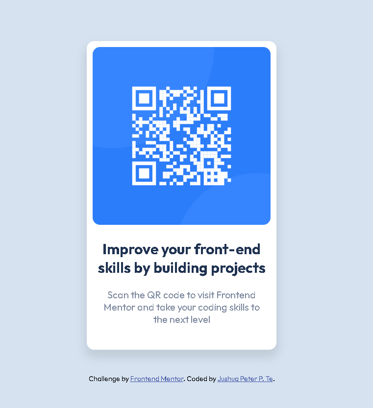

# Frontend Mentor - QR code component solution

This is a solution to the [QR code component challenge on Frontend Mentor](https://www.frontendmentor.io/challenges/qr-code-component-iux_sIO_H). Frontend Mentor challenges help you improve your coding skills by building realistic projects. 

## Table of contents

- [Overview](#overview)
  - [Screenshot](#screenshot)
  - [Links](#links)
- [My process](#my-process)
  - [Built with](#built-with)
  - [What I learned](#what-i-learned)
  - [Continued development](#continued-development)
  - [Useful resources](#useful-resources)
- [Author](#author)

## Overview

### Screenshot



### Links

- Solution URL: [https://github.com/JushuaPeterTe/Frontend-Mentor-Challenge---QR-Code-Component](https://github.com/JushuaPeterTe/Frontend-Mentor-Challenge---QR-Code-Component)
- Live Site URL: [https://jushuapeterte.github.io/Frontend-Mentor-Challenge---QR-Code-Component/qr-code-component-main/](https://jushuapeterte.github.io/Frontend-Mentor-Challenge---QR-Code-Component/qr-code-component-main/)

## My process

### Built with

- Semantic HTML5 markup
- CSS custom properties
- Flexbox

### What I learned

I am proud of taking my time to find ways to properly display the output by placing the contents in different div boxes. I am also proud of figuring how to adjust the content box and setting it in the center of the page by using '100vh' and margin 'auto'.

```html
<div class="main-container">
    <div class="sub-container">
      <div class="content">
        
        <h2><b>Improve your front-end skills by building projects</b></h2>
        <p>Scan the QR code to visit Frontend Mentor and take your coding skills to the next level</p>
      </div>
  
      <div class="attribution">
        Challenge by <a href="https://www.frontendmentor.io?ref=challenge" target="_blank">Frontend Mentor</a>. 
        Coded by <a href="#">Jushua Peter P. Te</a>.
      </div>
    </div>
  </div>
```
```css
.main-container {
    display: flex;
    height: 100vh;
    justify-content: center;
}

.sub-container {
    margin: auto;
}

.content {
    background-color: var(--White);
    border-radius: 12px;
    box-shadow: 0px 10px 15px 3px rgba(0, 0, 0, 0.099);
    padding: 10px;
    padding-bottom: 40px;
    pointer-events: none;
    text-align: center;
    width: 290px;
}
```

### Continued development

I will use this as my referrence when making future projects regarding to qr codes.

### Useful resources

- [Google Fonts](https://fonts.google.com/) - This helped me for finding the 'Outfit: 400, 700' font. I really liked this font and will use it going forward.

## Author

- Website - [Jushua Peter P. Te](https://jushuapeterte.github.io/Frontend-Mentor-Challenge---QR-Code-Component/qr-code-component-main/)
- Frontend Mentor - [@JushuaPeterTe](https://www.frontendmentor.io/profile/JushuaPeterTe)
